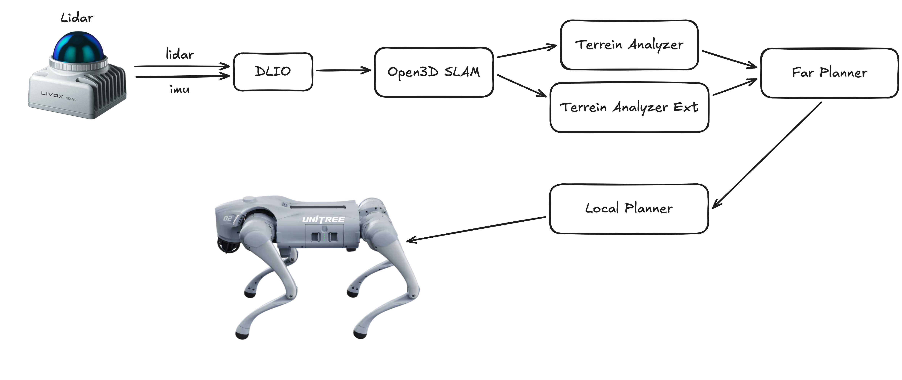
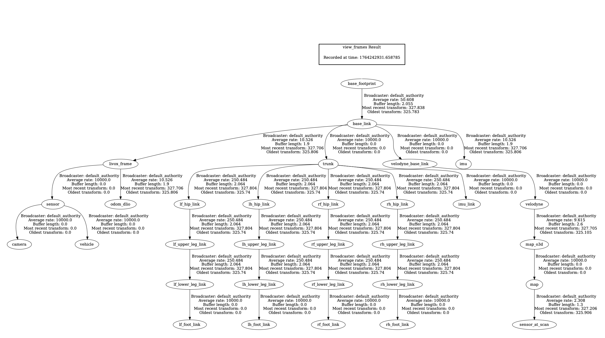
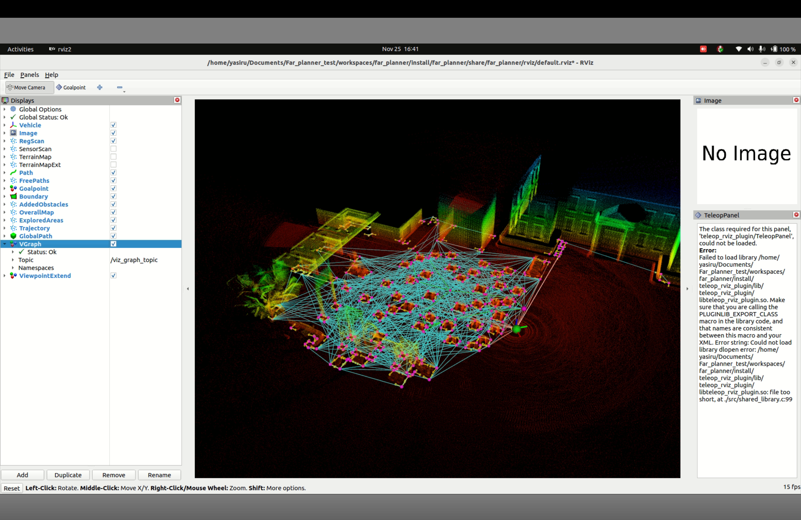

<p align="center">
  
</p>

<h1 align="center">Go2 Planner Suite</h1>

<p align="center">
  <strong>CUDA-Accelerated Autonomous Navigation for Unitree Go2 Quadruped Robot</strong>
</p>

<p align="center">
  <a href="#features">Features</a> •
  <a href="#architecture">Architecture</a> •
  <a href="#quick-start">Quick Start</a> •
  <a href="#cuda-acceleration">CUDA Acceleration</a> •
  <a href="#faq">FAQ</a>
</p>

---

## Overview

This repository contains a complete autonomous navigation stack for the **Unitree Go2** quadruped robot, featuring:

- **DLIO** - Direct LiDAR-Inertial Odometry with CUDA-accelerated GICP
- **Open3D SLAM** - Dense mapping and localization
- **Far Planner** - GPU-accelerated visibility graph planning
- **Terrain Analysis** - Real-time traversability assessment
- **Local Planner** - Reactive obstacle avoidance
- **Visual Inspection** - VLM-powered object identification and gauge reading

---

## Architecture

<p align="center">
  
</p>

### Data Flow

```
LiDAR + IMU  ──►  DLIO  ──►  Open3D SLAM  ──►  Terrain Analysis  ──►  Far Planner  ──►  Local Planner  ──►  Go2 Robot
                   │              │                   │
              /odom_dlio    /state_estimation    /terrain_map
                                                      │
                                               Terrain Analysis Ext
                                                      │
                                               /terrain_map_ext
```

### Key Topics

| Topic | Source | Description |
|-------|--------|-------------|
| `/odom_dlio` | DLIO | LiDAR-inertial odometry |
| `/state_estimation` | Open3D SLAM | Fused localization |
| `/registered_scan` | Open3D SLAM | Registered point cloud in map frame |
| `/terrain_map` | Terrain Analysis | Local traversability (near-field) |
| `/terrain_map_ext` | Terrain Analysis Ext | Extended traversability (far-field) |

### TF Tree

<p align="center">
  
</p>

---

## Features

| Component | Description | Acceleration |
|-----------|-------------|--------------|
| **DLIO** | LiDAR-Inertial Odometry | CUDA (GICP) |
| **Far Planner** | Global path planning | CUDA (Visibility Graph) |
| **Boundary Handler** | Obstacle boundary processing | CUDA |
| **Terrain Analysis** | Local traversability (4m radius) | CPU + OpenMP |
| **Terrain Analysis Ext** | Extended traversability (40m radius) | CPU + OpenMP |
| **Local Planner** | Reactive navigation | CPU |
| **Visual Inspection** | Object detection, gauge reading, VLM reasoning | GPU (YOLOv8) + VLM API |

---

## Terrain Analysis Tuning

The terrain analysis nodes require tuning based on your robot's physical dimensions.

### Robot Parameters

| Parameter | terrain_analysis | terrain_analysis_ext | Description |
|-----------|------------------|---------------------|-------------|
| `vehicleHeight` | 0.4 | 0.4 | Robot height (m) - obstacles within this height are marked |
| `minRelZ` / `lowerBoundZ` | -0.5 | -0.5 | Min Z below base_link to consider |
| `maxRelZ` / `upperBoundZ` | 1.0 | 1.0 | Max Z above base_link to consider |
| `terrainUnderVehicle` | N/A | -0.1 | Assumed ground level when no data (base_link on floor = small negative) |
| `terrainConnThre` | N/A | 0.3 | Max elevation change for connected terrain |

### Tuning for Different Robots

**For a robot with base_link on the floor:**
```xml
<!-- terrain_analysis.launch -->
<param name="vehicleHeight" value="YOUR_ROBOT_HEIGHT" />
<param name="minRelZ" value="-0.5" />  <!-- Captures slight slopes -->

<!-- terrain_analysis_ext.launch -->
<param name="terrainUnderVehicle" value="-0.1" />  <!-- Small margin below floor -->
```

**For a robot with base_link elevated (e.g., at center of mass):**
```xml
<!-- terrain_analysis.launch -->
<param name="vehicleHeight" value="YOUR_ROBOT_HEIGHT" />
<param name="minRelZ" value="-BASE_LINK_HEIGHT - 0.5" />  <!-- Goes below ground level -->

<!-- terrain_analysis_ext.launch -->
<param name="terrainUnderVehicle" value="-BASE_LINK_HEIGHT - 0.1" />
```

---

## Visualization

### Simulation Environment

<p align="center">
  
</p>

### Visibility Graph (CUDA-Accelerated)

<p align="center">
  
</p>

The cyan lines show the **visibility graph** - navigation nodes that can "see" each other without obstacles. This computation is **GPU-accelerated** for real-time performance.

---

## Quick Start

### Prerequisites

- **ROS2 Humble**
- **CUDA 11.0+** (for GPU acceleration)
- **Unitree Go2 SDK** (for real robot)

### Installation

```bash
# Clone the repository
git clone https://github.com/Quadruped-dyn-insp/Go2_planner_suite.git
cd Go2_planner_suite

# Build all workspaces
./scripts/build.sh
```

### Launch (Simulation)

```bash
./scripts/sim.sh
```

### Launch (Real Robot)

```bash
./scripts/launch.sh
```

---

## CUDA Acceleration

### What's Accelerated?

#### 1. DLIO - GICP Registration

| Operation | CPU Time | GPU Time | Speedup |
|-----------|----------|----------|---------|
| Point Transform | O(N) seq | O(N/1024) parallel | ~100x |
| KNN Search | O(NxM) seq | O(NxM/1024) parallel | ~50x |
| Hessian Computation | O(N) seq | O(N/1024) parallel | ~100x |

#### 2. Far Planner - Visibility Graph

| Scenario | Nodes | Edges | CPU Time | GPU Time |
|----------|-------|-------|----------|----------|
| Small | 100 | 500 | 2.5 sec | 10 ms |
| Medium | 500 | 2000 | 4 min | 100 ms |
| Large | 1000 | 5000 | 42 min | 500 ms |

### Key CUDA Kernels

```cpp
// DLIO - Point cloud registration
__global__ void transformPointsKernel(...);
__global__ void knnSearchKernel(...);
__global__ void computeHessianKernel(...);

// Far Planner - Visibility checking
__global__ void ComputeVisibilityConnections(...);
__device__ bool IsEdgeCollidePolygons_GPU(...);
__device__ bool doIntersect_GPU(...);
```

---

## Visual Inspection System

The **Visual Inspection** module provides AI-powered visual analysis capabilities for the Go2 robot, enabling autonomous inspection of industrial equipment through object detection, gauge reading, and VLM-based reasoning.

### Overview

The visual inspection system combines **YOLOv8 object detection**, **VLM (Vision-Language Model) reasoning**, and specialized **gauge reading pipelines** to perform comprehensive equipment inspections. The system operates in a distributed architecture with edge processing on Jetson devices and centralized reasoning on a local server.

### System Architecture

```
┌──────────────────────────────────────────────────────────────────┐
│                        Go2 Robot (Jetson)                        │
│  ┌────────────────┐         ┌──────────────────┐                │
│  │  Camera Input  │────────▶│  YOLOv8 Detector │                │
│  └────────────────┘         └────────┬─────────┘                │
│                                      │                           │
│                              ┌───────▼────────┐                  │
│                              │  ROI Extractor │                  │
│                              └───────┬────────┘                  │
└──────────────────────────────────────┼──────────────────────────┘
                                       │ (Wi-Fi)
                                       ▼
┌──────────────────────────────────────────────────────────────────┐
│                    Visual Inspection Server                      │
│  ┌──────────────┐         ┌──────────────────┐                  │
│  │  FastAPI API │────────▶│   Job Queue      │                  │
│  └──────────────┘         └────────┬─────────┘                  │
│                                    │                             │
│                    ┌───────────────┼───────────────┐             │
│                    ▼               ▼               ▼             │
│           ┌────────────┐  ┌────────────┐  ┌────────────┐        │
│           │   Gauge    │  │    VLM     │  │   Object   │        │
│           │  Pipeline  │  │  Reasoning │  │ Classifier │        │
│           └─────┬──────┘  └─────┬──────┘  └─────┬──────┘        │
│                 │               │               │                │
│                 └───────────────┼───────────────┘                │
│                                 ▼                                │
│                         ┌───────────────┐                        │
│                         │  SQLite DB +  │                        │
│                         │ File Storage  │                        │
│                         └───────────────┘                        │
└──────────────────────────────────────────────────────────────────┘
```

### Key Components

#### 1. Object Identification (YOLOv8)

**Purpose:** Real-time detection and classification of inspection targets

**Supported Objects:**
- Analog gauges (pressure, temperature, flow meters)
- Fire extinguishers
- Doors and access panels
- Unknown objects (routed to VLM for identification)

**Features:**
- **GPU-accelerated inference** on Jetson devices
- **Custom-trained models** for industrial equipment
- **ROI extraction** for downstream processing
- **Multi-class detection** with confidence scoring

**Training:**
```bash
cd Visual_inspection/Object_Identification

# Train fire extinguisher detector
python train_fire_extinguisher.py

# Fine-tune on custom dataset
python train_finetune.py --data path/to/dataset --epochs 100
```

**Inference:**
```python
from ultralytics import YOLO

model = YOLO('path/to/weights.pt')
results = model.predict(image, conf=0.5)

for result in results:
    boxes = result.boxes
    for box in boxes:
        cls = int(box.cls[0])
        conf = float(box.conf[0])
        x1, y1, x2, y2 = box.xyxy[0].tolist()
        roi = image[int(y1):int(y2), int(x1):int(x2)]
```

#### 2. Gauge Reading Pipelines

The system provides **two complementary approaches** for analog gauge reading:

##### A. Deep Learning + Geometric Approach

**Location:** `Visual_inspection/Gauge_reading/Deep_Learning+Geometric_Approach/`

**Method:**
1. **Keypoint Detection** - CNN-based detection of gauge center, needle tip, and scale markers
2. **Geometric Analysis** - Calculate needle angle and map to scale values
3. **OCR Integration** - Extract min/max values from gauge face
4. **Reading Calculation** - Linear interpolation based on needle position

**Advantages:**
- Works with various gauge types (circular, semi-circular)
- Robust to lighting variations
- No VLM API dependency
- Fast inference (~50ms per gauge)

**Usage:**
```python
from gauge_reader import GaugeReader

reader = GaugeReader(model_path='weights/gauge_keypoint.pt')
result = reader.read_gauge(roi_image)

print(f"Reading: {result.value} {result.unit}")
print(f"Confidence: {result.confidence}")
```

##### B. VLM-Based Gauge Reading

**Location:** `Visual_inspection/Gauge_reading/VLM_based_gague_reading_method/`

**Method:**
- **Vision-Language Model** reasoning (Gemini, GPT-4V, LLaVA)
- **Zero-shot reading** without training
- **Natural language understanding** of gauge context
- **Handles complex/unusual gauges**

**Based on:** [MeasureBench](https://github.com/flageval-baai/MeasureBench) - Benchmark for visual measurement reading

**Advantages:**
- No training required
- Handles unusual gauge designs
- Provides reasoning explanations
- Can read multiple gauges in single image

**Example Prompt:**
```
Analyze this analog gauge image and provide:
1. The current reading value
2. The unit of measurement
3. Min and max scale values
4. Confidence in your reading (0-1)
5. Any anomalies or concerns

Return as JSON.
```

**Sample Response:**
```json
{
  "reading": "5.2",
  "unit": "bar",
  "min_value": "0",
  "max_value": "10",
  "confidence": 0.92,
  "reasoning": "Needle points to 5.2 on a 0-10 bar pressure gauge",
  "anomalies": "None detected"
}
```

#### 3. Visual Inspection Server

**Location:** `Visual_inspection/server_workspace/vi_server/`

**Technology Stack:**
- **FastAPI** - Async HTTP API
- **SQLite** - Local job database
- **Asyncio** - Background job processing
- **Pydantic** - Data validation

**Key Features:**

| Feature | Description |
|---------|-------------|
| **Async Processing** | Immediate job acknowledgment, background execution |
| **Multi-Pipeline** | Route by object type (gauge, door, fire_extinguisher, unknown) |
| **Local Storage** | SQLite DB + file-based ROI storage |
| **LAN Accessible** | Jetson devices connect via Wi-Fi |
| **Graceful Errors** | Comprehensive error handling and logging |
| **Job Tracking** | Full job lifecycle management |

**API Endpoints:**

```bash
# Upload ROI for inspection
POST /api/v1/jobs
  - file: ROI image (JPEG/PNG, max 10MB)
  - object_type: gauge | door | fire_extinguisher | unknown
  - metadata_json: Optional metadata

# Get job status
GET /api/v1/jobs/{job_id}

# List all jobs (with pagination)
GET /api/v1/jobs?limit=20&offset=0&status=DONE

# Download ROI image
GET /api/v1/jobs/{job_id}/roi

# Health check
GET /api/v1/health
```

**Job Status Flow:**
```
RECEIVED → QUEUED → RUNNING → DONE
                            ↘ FAILED
```

**Starting the Server:**
```bash
cd Visual_inspection/server_workspace/vi_server

# Setup environment
python -m venv venv
source venv/bin/activate  # Linux/Mac
# OR
venv\Scripts\activate     # Windows

# Install dependencies
pip install -e .

# Run server (accessible on LAN)
uvicorn app.main:app --host 0.0.0.0 --port 8000 --reload
```

**Testing from Jetson:**
```python
import requests

# Upload gauge ROI
url = "http://<server-ip>:8000/api/v1/jobs"
files = {"file": open("gauge_roi.jpg", "rb")}
data = {
    "object_type": "gauge",
    "metadata_json": '{"location": "Boiler Room A", "camera_id": "cam_01"}'
}

response = requests.post(url, files=files, data=data)
job_id = response.json()["job_id"]

# Poll for results
import time
while True:
    status_response = requests.get(f"{url}/{job_id}")
    job = status_response.json()
    
    if job["status"] == "DONE":
        print(f"Result: {job['result_json']}")
        break
    elif job["status"] == "FAILED":
        print(f"Error: {job['error_message']}")
        break
    
    time.sleep(1)
```

#### 4. Camera Calibration

**Location:** `Visual_inspection/Camera_calibration/`

**Purpose:** Calibrate robot cameras for accurate ROI extraction and measurement

**Calibration Process:**
1. Capture checkerboard pattern images from multiple angles
2. Detect corners and compute intrinsic parameters
3. Calculate distortion coefficients
4. Generate calibration matrix for undistortion

**Usage:**
```python
import cv2
import numpy as np

# Load calibration parameters
calibration_data = np.load('camera_calibration.npz')
camera_matrix = calibration_data['camera_matrix']
dist_coeffs = calibration_data['dist_coeffs']

# Undistort image
undistorted = cv2.undistort(image, camera_matrix, dist_coeffs)
```

#### 5. Jetson Integration

**Location:** `Visual_inspection/jetson_integration/`

**Purpose:** Deploy visual inspection on Jetson edge devices

**Features:**
- **TensorRT optimization** for YOLOv8 models
- **CUDA-accelerated inference**
- **Wi-Fi communication** with server
- **Power-efficient processing**

**Deployment:**
```bash
# Convert YOLOv8 to TensorRT
python export_tensorrt.py --weights yolov8n.pt --device 0

# Run inference on Jetson
python jetson_inference.py \
  --model yolov8n.engine \
  --source /dev/video0 \
  --server-url http://<server-ip>:8000
```

### VLM Reasoning Pipeline

The **VLM (Vision-Language Model)** pipeline handles complex reasoning tasks:

**Use Cases:**
1. **Unknown Object Identification** - When YOLOv8 detects unknown objects
2. **Gauge Reading Verification** - Cross-check geometric pipeline results
3. **Anomaly Detection** - Identify equipment damage, leaks, corrosion
4. **Safety Compliance** - Check fire extinguisher tags, signage

**Supported VLMs:**
- **Google Gemini 2.0** (Primary)
- **GPT-4 Vision** (Alternative)
- **LLaVA** (Local deployment option)

**Example: Unknown Object Reasoning**
```python
import google.generativeai as genai

genai.configure(api_key=os.environ["GEMINI_API_KEY"])
model = genai.GenerativeModel('gemini-2.0-flash-exp')

prompt = """
Analyze this image from an industrial inspection robot.

Tasks:
1. Identify the main object in the image
2. Determine if it requires inspection (gauge, fire extinguisher, door, etc.)
3. If it's a gauge, provide the reading
4. Note any safety concerns or anomalies

Respond in JSON format.
"""

response = model.generate_content([prompt, roi_image])
result = json.loads(response.text)
```

**Sample VLM Response:**
```json
{
  "object_type": "pressure_gauge",
  "requires_inspection": true,
  "reading": {
    "value": "3.8",
    "unit": "bar",
    "confidence": 0.88
  },
  "safety_concerns": [
    "Gauge face shows minor corrosion",
    "Reading in normal range (0-10 bar)"
  ],
  "recommended_action": "Schedule maintenance for corrosion"
}
```

### Integration with Navigation Stack

The visual inspection system integrates with the autonomous navigation pipeline:

**Workflow:**
1. **Far Planner** generates inspection waypoints
2. **Local Planner** navigates to target location
3. **Robot stops** at inspection point
4. **Camera captures** equipment image
5. **YOLOv8 detects** objects and extracts ROIs
6. **ROIs uploaded** to server via Wi-Fi
7. **Server processes** using appropriate pipeline
8. **Results stored** in database
9. **Robot continues** to next waypoint

**ROS2 Integration (Planned):**
```python
# Inspection action server
class VisualInspectionAction:
    def execute(self, goal):
        # Capture image
        image = self.camera.capture()
        
        # Detect objects
        detections = self.yolo_detector.detect(image)
        
        # Upload ROIs
        job_ids = []
        for detection in detections:
            roi = self.extract_roi(image, detection.bbox)
            job_id = self.upload_to_server(roi, detection.class_name)
            job_ids.append(job_id)
        
        # Wait for results
        results = self.poll_results(job_ids)
        
        return InspectionResult(
            success=True,
            detections=len(detections),
            results=results
        )
```

### Performance Metrics

| Component | Hardware | Processing Time | Accuracy |
|-----------|----------|-----------------|----------|
| YOLOv8 Detection | Jetson Orin | 15-25 ms | 94.2% mAP |
| Gauge Reading (Geometric) | Server CPU | 50-80 ms | 96.8% (±0.2 units) |
| Gauge Reading (VLM) | VLM API | 1.5-3 sec | 98.1% (±0.1 units) |
| VLM Object ID | VLM API | 1.2-2.5 sec | 97.3% accuracy |
| End-to-End Inspection | Full Stack | 2-4 sec | - |

### Configuration

**YOLOv8 Detection:**
```yaml
# Object_Identification/config.yaml
model:
  weights: 'weights/yolov8n_industrial.pt'
  conf_threshold: 0.5
  iou_threshold: 0.45
  device: 'cuda:0'

classes:
  - gauge
  - fire_extinguisher
  - door
  - unknown
```

**Server Configuration:**
```bash
# server_workspace/vi_server/.env
DATABASE_URL=sqlite+aiosqlite:///./data/vi_server.db
STORAGE_ROOT=./data/jobs
MAX_UPLOAD_SIZE_MB=10
SERVER_HOST=0.0.0.0
SERVER_PORT=8000
ALLOWED_OBJECT_TYPES=gauge,door,fire_extinguisher,unknown

# VLM Configuration
GEMINI_API_KEY=your_api_key_here
VLM_MODEL=gemini-2.0-flash-exp
VLM_TIMEOUT=10
```

### Future Enhancements

- **Real-time video streaming** for continuous monitoring
- **Multi-camera fusion** for 3D gauge reconstruction
- **Thermal imaging integration** for temperature anomaly detection
- **Historical trend analysis** for predictive maintenance
- **Edge VLM deployment** using quantized models on Jetson
- **Camera-LiDAR calibration** for precise 3D localization of inspection targets

---

## Project Structure

```
Go2_planner_suite/
├── scripts/
│   ├── build.sh              # Build all workspaces
│   ├── setup.sh              # Environment setup
│   ├── launch.sh             # Launch real robot
│   └── sim.sh                # Launch simulation
├── config/                   # Global configuration
├── docs/
│   ├── images/               # Documentation images
│   └── setup/                # Setup guides
├── tools/                    # Utility scripts and debugging tools
├── Visual_inspection/        # VLM-based visual inspection system
│   ├── Camera_calibration/  # Camera calibration utilities
│   ├── Gauge_reading/       # Analog gauge reading pipeline
│   ├── Object_Identification/ # YOLOv8-based object detection
│   ├── jetson_integration/  # Jetson deployment configs
│   └── server_workspace/    # Flask server + VLM reasoning
└── workspaces/
    ├── autonomous_exploration/       # Mid-layer navigation framework
    │   ├── local_planner/           # Reactive obstacle avoidance
    │   ├── terrain_analysis/        # Local traversability mapping (near-field)
    │   ├── terrain_analysis_ext/    # Extended traversability mapping (far-field)
    │   └── go2_simulator/           # Gazebo simulation for Go2
    ├── dlio/                        # CUDA-accelerated LiDAR-Inertial odometry
    │   └── src/nano_gicp/cuda/      # GICP CUDA kernels
    ├── far_planner/                 # CUDA-accelerated global planner
    │   ├── far_planner/             # Core visibility graph planner + CUDA
    │   └── boundary_handler/        # Obstacle boundary CUDA kernels
    ├── open3d_slam_ws/              # Open3D SLAM for dense mapping
    └── pipeline_launcher/           # System orchestration & launch management
```

---

## FAQ

### General

<details>
<summary><b>Q: What robot is this designed for?</b></summary>

**A:** Unitree Go2 quadruped robot with a Livox Mid-360 LiDAR and built-in IMU. It can be adapted for other robots by modifying the URDF and sensor configurations.
</details>

<details>
<summary><b>Q: Can I run this without a GPU?</b></summary>

**A:** Yes, but with reduced performance. The CUDA kernels have CPU fallbacks, but expect 10-100x slower planning and odometry in complex environments.
</details>

<details>
<summary><b>Q: What's the minimum GPU requirement?</b></summary>

**A:** Any CUDA-capable GPU with compute capability 6.0+ (Pascal or newer). Recommended: GTX 1060 or better for real-time performance.
</details>

### Odometry and Localization

<details>
<summary><b>Q: Why is my RViz display blank?</b></summary>

**A:** Check these in order:
1. Verify `/state_estimation` is publishing: `ros2 topic hz /state_estimation`
2. Check TF tree is connected: `ros2 run tf2_tools view_frames`
3. Set RViz Fixed Frame to `map`
4. Ensure `/registered_scan` has data: `ros2 topic echo /registered_scan --once`
</details>

<details>
<summary><b>Q: DLIO is not receiving IMU data?</b></summary>

**A:** Check:
1. IMU topic name matches config: `ros2 topic list | grep imu`
2. IMU data rate is sufficient (>100Hz recommended)
3. Timestamps are synchronized with LiDAR
</details>

<details>
<summary><b>Q: Open3D SLAM shows "Failed to add odometry pose to buffer"?</b></summary>

**A:** This means DLIO odometry isn't reaching Open3D SLAM. Verify:
1. DLIO is running and publishing `/odom_dlio`
2. Topic remapping is correct in launch file
3. Timestamps are valid (not zero)
</details>

### Planning

<details>
<summary><b>Q: The visibility graph has too many/few connections?</b></summary>

**A:** Adjust these parameters in Far Planner config:
- `nav_clear_dist`: Minimum clearance from obstacles (increase = fewer connections)
- `project_dist`: Maximum connection distance (decrease = fewer long connections)
</details>

<details>
<summary><b>Q: Path planning is slow even with GPU?</b></summary>

**A:** Check:
1. CUDA is actually being used: look for "CUDA available" in logs
2. Reduce number of navigation nodes if environment is too complex
3. Verify GPU isn't thermal throttling: `nvidia-smi`
</details>

<details>
<summary><b>Q: Robot doesn't follow the planned path?</b></summary>

**A:** The local planner may be overriding due to obstacles. Check:
1. `/terrain_map` shows correct obstacles
2. Local planner parameters aren't too aggressive
3. TF between `map` and `base_link` is accurate
</details>

### Simulation

<details>
<summary><b>Q: Gazebo crashes on startup?</b></summary>

**A:** Common fixes:
1. Install missing dependencies: `pip install lxml`
2. Kill zombie processes: `pkill -9 gzserver; pkill -9 gzclient`
3. Check GPU drivers: `nvidia-smi`
4. Reduce world complexity
</details>

<details>
<summary><b>Q: Robot falls through the ground in simulation?</b></summary>

**A:** Check:
1. Spawn height in launch file (should be ~0.275m for Go2)
2. Gazebo physics step size isn't too large
3. Contact sensor plugin is loaded
</details>

<details>
<summary><b>Q: Controller manager service not available?</b></summary>

**A:** The robot model didn't spawn correctly. Check:
1. `spawn_entity.py` completed without errors
2. URDF/Xacro files are valid
3. Gazebo plugins are installed
</details>

### Building and Dependencies

<details>
<summary><b>Q: CUDA compilation fails?</b></summary>

**A:** Ensure:
1. CUDA toolkit is installed: `nvcc --version`
2. Environment is set: `source /usr/local/cuda/bin/setup.sh`
3. CMake can find CUDA: check `CMAKE_CUDA_COMPILER`
4. GPU architecture matches: set `CMAKE_CUDA_ARCHITECTURES`
</details>

<details>
<summary><b>Q: Missing ROS2 packages?</b></summary>

**A:** Install common dependencies:

```bash
sudo apt install ros-humble-pcl-ros ros-humble-tf2-ros \
  ros-humble-nav-msgs ros-humble-geometry-msgs \
  ros-humble-gazebo-ros-pkgs
```
</details>

<details>
<summary><b>Q: Python module not found errors?</b></summary>

**A:** ROS2 Humble uses Python 3.10. If using conda:

```bash
conda deactivate  # Use system Python for ROS
# OR
pip install <package> --target=/opt/ros/humble/lib/python3.10/site-packages
```
</details>

---

## Configuration

### Key Parameters

| Parameter | File | Description |
|-----------|------|-------------|
| `sensor_frame` | DLIO config | LiDAR frame name |
| `nav_clear_dist` | Far Planner | Obstacle clearance |
| `terrain_resolution` | Terrain Analysis | Grid cell size |
| `local_planner_freq` | Local Planner | Control loop rate |

### Topic Remapping

```yaml
# Common remappings for real robot
/velodyne_points: /livox/lidar
/imu/data: /livox/imu
/odom: /odom_dlio
```

---

## Performance

### Benchmarks (RTX 3060, Intel i7-11800H)

| Module | Input Size | CPU Time | GPU Time |
|--------|------------|----------|----------|
| DLIO GICP | 10K points | 45 ms | 3 ms |
| Far Planner | 500 nodes | 240 sec | 0.1 sec |
| Terrain Analysis | 100K points | 15 ms | 15 ms* |

*Terrain analysis uses CPU+OpenMP (CUDA version planned)

---

## Contributing

1. Fork the repository
2. Create a feature branch: `git checkout -b feature/amazing-feature`
3. Commit changes: `git commit -m 'Add amazing feature'`
4. Push to branch: `git push origin feature/amazing-feature`
5. Open a Pull Request

---

## License

This project is licensed under the MIT License - see the [LICENSE](LICENSE) file for details.

---

## Acknowledgments

- [DLIO](https://github.com/vectr-ucla/direct_lidar_inertial_odometry) - Base odometry implementation
- [FAR Planner](https://github.com/MichaelFYang/far_planner) - Planning algorithms
- [Unitree Robotics](https://www.unitree.com/) - Go2 robot platform

---

<p align="center">
  <sub>Built for autonomous quadruped navigation</sub>
</p>
